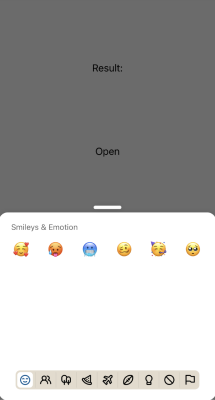

:::info
To preview app with this example, clone [**github repo**](https://github.com/TheWidlarzGroup/rn-emoji-keyboard.git) and run `yarn example ios` or `yarn example android`.
:::

### Usage

It's possible to pass your own set of emojis. You have to keep in mind that types and category titles must match the ones that we are using. In the example you can see custom emojis set that contains only emojis with unicode version === 11.

Passing your set of emojis allows you to support translated keywords, names and custom emojis

```tsx
import EmojiPicker, { emojisByCategory } from 'rn-emoji-keyboard'
import { isUnicodeEmoji } from '../../../src/utils/parseEmoji'
import type { EmojisByCategory } from 'src/types'
import { Image } from 'react-native'

const getCustomEmojis = () => {
  const newEmojiSet: EmojisByCategory[] = []

  // Filter in categories, emojis version equal to unicode 11
  for (const [, value] of Object.entries(emojisByCategory)) {
    const newData = value.data.filter(
      (emoji) => isUnicodeEmoji(emoji) && parseFloat(emoji.v) === 11,
    )
    newEmojiSet.push({
      title: value.title,
      data: newData,
    })
  }

  // Add in custom category URI sourced emojis
  // Can be either a distant https:// or a base64 formatted image or a resolved image asset
  const customCategoryIndex = emojisByCategory.findIndex(({ title }) => title === 'custom')
  newEmojiSet[customCategoryIndex]!.data = [
    {
      uri: Image.resolveAssetSource(require('example/assets/custom/shhhh.webp')).uri,
      keywords: ['shhhh', 'face'],
      name: 'shhhh',
    },
    {
      uri: Image.resolveAssetSource(require('example/assets/custom/silly.webp')).uri,
      keywords: ['silly', 'face'],
      name: 'silly',
    },
    {
      uri: Image.resolveAssetSource(require('example/assets/custom/woah.webp')).uri,
      keywords: ['woaah', 'face'],
      name: 'woaah',
    },
  ]
  return newEmojiSet
}

const ExampleComponent = () => {
  // ...

  return (
    <EmojiPicker
      open={isOpen}
      onClose={handleOnClose}
      onEmojiSelected={handleOnEmojiSelected}
      emojisByCategory={getCustomEmojis()}
    />
  )
}
```


