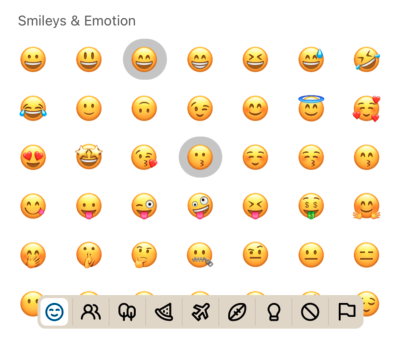

:::info
To preview app with this example, clone [**github repo**](https://github.com/TheWidlarzGroup/rn-emoji-keyboard.git) and run `yarn example ios` or `yarn example android`.
:::

### Usage

To use this feature you have to pass a [selectedEmojis](/docs/api/modal#selectedemojis) array with emoji names.
When you provide selectedEmojis array, `onEmojiSelected` callback will also return `alreadySelected` boolean indicating whether pressed emoji was already selected or not.

```jsx
import EmojiPicker, { type EmojiType } from 'rn-emoji-keyboard';

const ExampleComponent = () => {
  // ...
  const [currentlySelectedEmojis, setCurrentlySelectedEmojis] = useState([])

  const handleOnEmojiSelected = (emoji: EmojiType) => {
    //..Your on select logic

    // Remove or add pressed emoji to the currently selected array
    if (emoji.alreadySelected)
      setCurrentlySelectedEmojis((prev) => prev.filter((a) => a !== emoji.name))
    else setCurrentlySelectedEmojis((prev) => [...prev, emoji.name])

  }

  return (
    <EmojiPicker
      open={isOpen}
      onClose={handleOnClose}
      onEmojiSelected={handleOnEmojiSelected}
      selectedEmojis={currentlySelectedEmojis}
    />
  )
}
```


